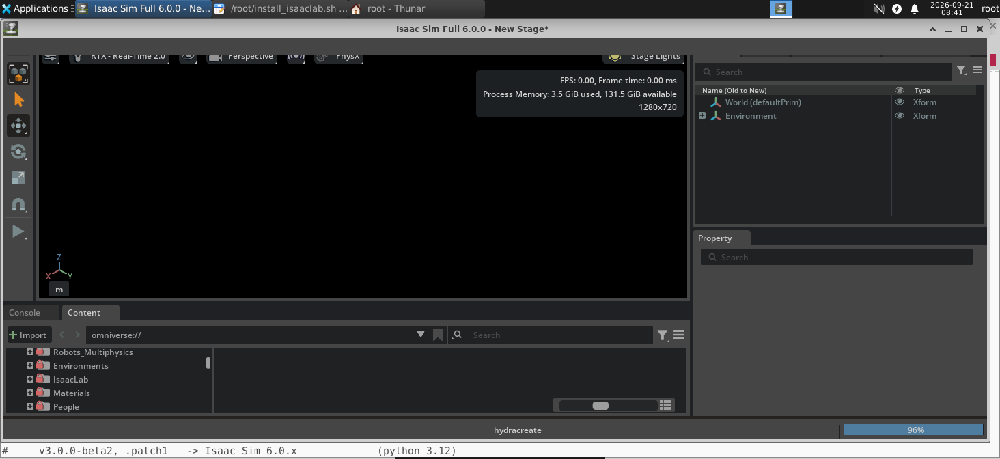

# vast-isaaclab

Run **NVIDIA Isaac Sim + Isaac Lab with a visible GUI** on Vast.ai container
instances — DCV/XFCE remote desktop inside the container, a script that installs
Isaac Lab next to Isaac Sim, and a recipe for baking it all into a reusable
Docker image.

Proven on a live Vast.ai instance: Isaac Sim 6.0.0, RTX 3090, driver 595.71.05.
Isaac Sim's own compatibility check passed (`Graphics API: Vulkan`), and the
Kit GUI rendered into the DCV desktop:



## Contents

| Path | What it is |
|---|---|
| [`scripts/onstart.sh`](scripts/onstart.sh) | Vast On-Start Script: XFCE + X/GL runtime + VS Code + root password + NICE DCV server + web viewer + `xfce-session`. Idempotent, survives re-runs |
| [`scripts/install_isaaclab.sh`](scripts/install_isaaclab.sh) | Installs Isaac Lab per the [Isaac Lab Docker Guide](https://isaac-sim.github.io/IsaacLab/main/source/deployment/docker.html), with `docker` and `native` modes (auto-detected), Isaac Sim version detection, `--check` / `--dry-run` |
| [`scripts/xwd2png.py`](scripts/xwd2png.py) | Screenshot the DCV display when nothing else is installed (XWD → PNG, pure stdlib) |
| [`docker/`](docker/) | Option B: `Dockerfile` + `dcv-start.sh` + `verify.sh` + `build.sh` — bake the whole stack into an image for future instances ([notes](docker/README.docker.md)) |
| [`docs/`](docs/) | Strategy notes: how to pick an approach, and portability rules |

## Quick start (daily driver)

On any Vast.ai instance of an `isaac-sim` image:

```bash
/root/onstart.sh                      # desktop + DCV (re-run is safe)
/root/install_isaaclab.sh --check     # pre-flight only
/root/install_isaaclab.sh             # the install (~10+ GB, tens of minutes)
```

Then, in the DCV desktop (`https://<host>:8443`, root / your password):

```bash
cd /workspace/isaaclab
./isaaclab.sh -p scripts/tutorials/00_sim/log_time.py --headless   # smoke test
./isaaclab.sh -p scripts/reinforcement_learning/rsl_rl/train.py --task Isaac-Cartpole-v0
# (drop --headless to watch it learn in the Kit viewport)
```

## Compatibility

Isaac Sim and Isaac Lab versions must match (IsaacLab README, "Isaac Sim
Version Dependency"). `install_isaaclab.sh` detects this automatically:

| Isaac Sim | Isaac Lab | Python |
|---|---|---|
| 4.5 / 5.0 / 5.1 | `main` / `v2.3.X` | 3.11 |
| **6.0.x** | **`v3.0.0-beta2(.patch1)`** | 3.12 |
| 6.1.x | `release/3.0.0` / `develop` | 3.12 |

## Security

See [`docs/SECURITY.md`](docs/SECURITY.md) before you rent, especially the
dev-default root password in `scripts/onstart.sh` — change it for anything
beyond a throwaway dev box.

## License

Scripts and docs in this repo: MIT (see [`LICENSE`](LICENSE)). They build on
NVIDIA's proprietary Isaac Sim / DCV components, which keep their own licenses
and still require `ACCEPT_EULA=Y`.
